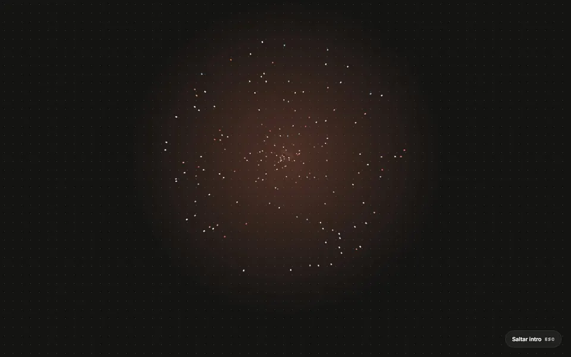
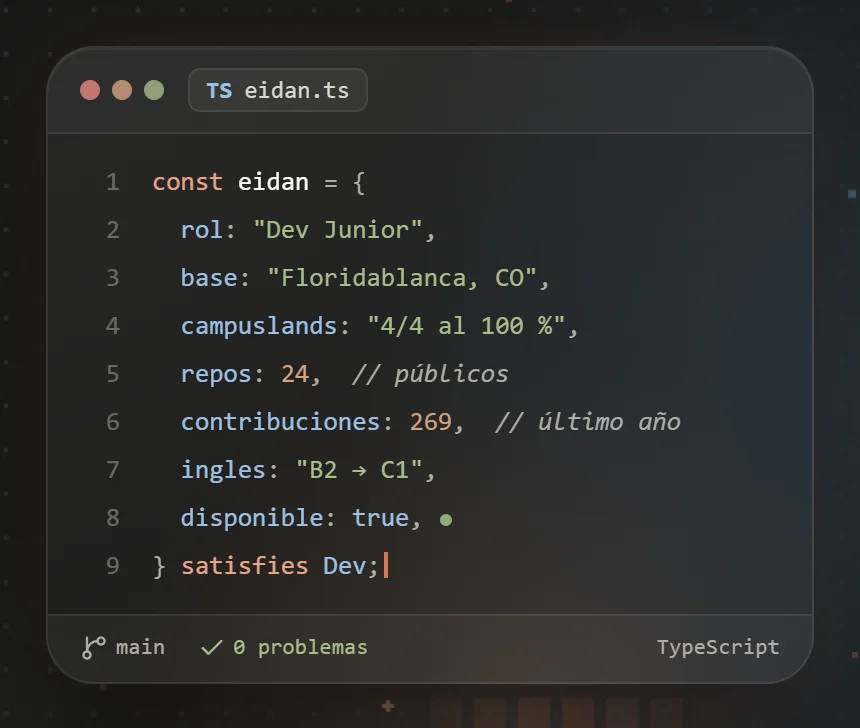
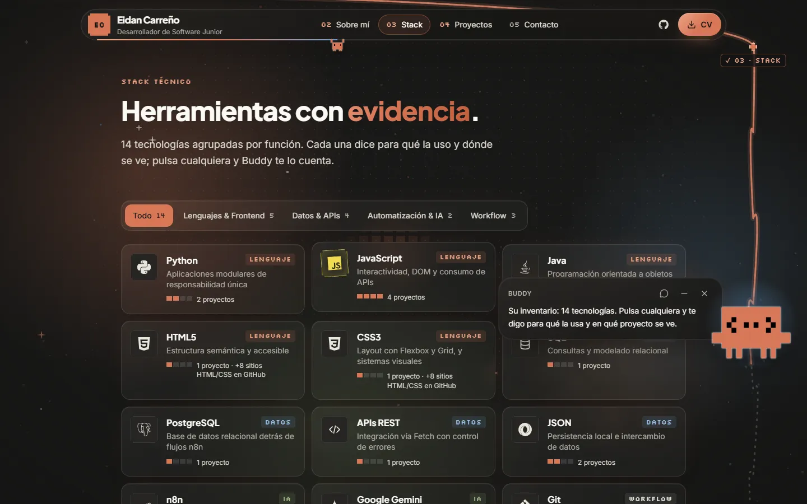
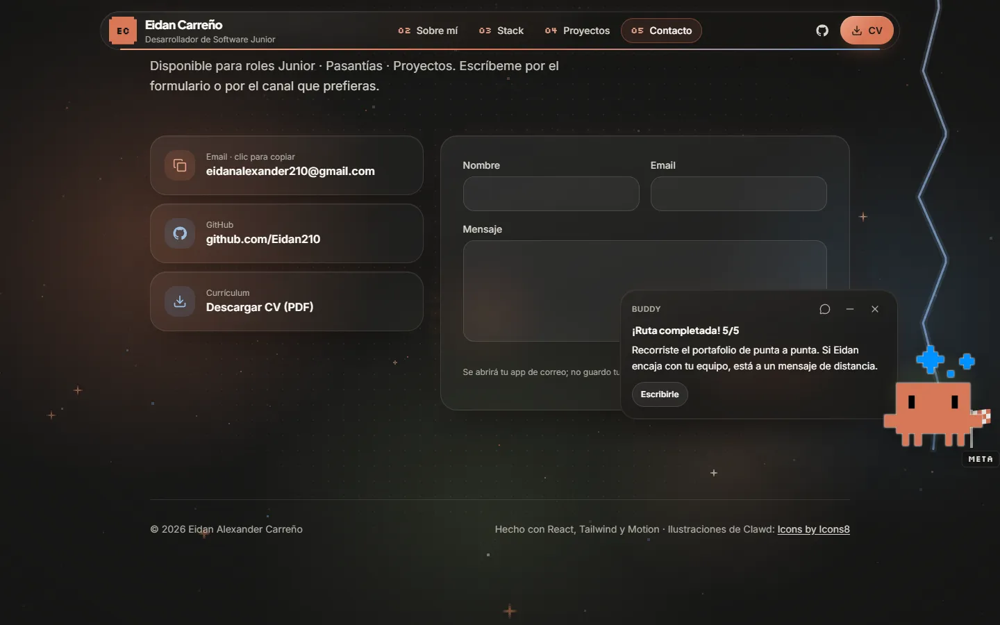
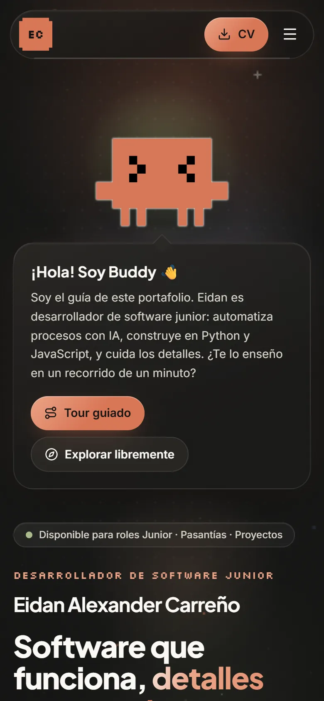
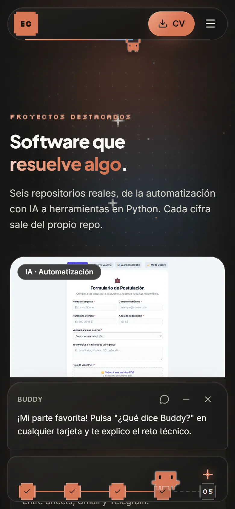
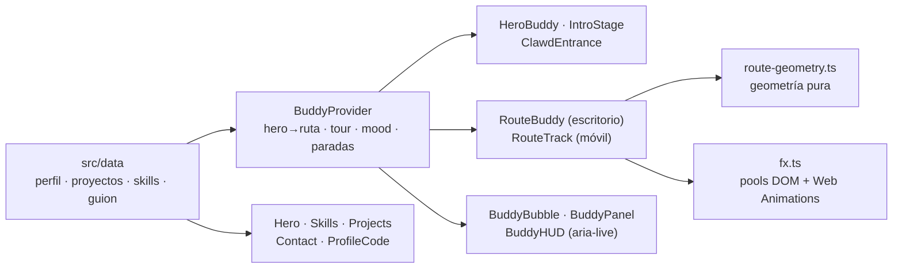

# Portafolio Buddy — Eidan Alexander Carreño

Mi portafolio personal: una web *one-page* con la paleta de Anthropic, estética *glass* + pixel art y una mascota guía, **Buddy** (Clawd). Buddy entra en escena, salta a una ruta que recorre toda la página siguiendo el scroll, recoge una chispa por sección y explica cada proyecto y tecnología con evidencia.

[](https://eidan210.github.io/portafolio-junior/)
[](https://github.com/Eidan210/portafolio-junior/actions/workflows/deploy.yml)




<sub>Intro de escritorio con la entrada <code>hiperespacio</code>, grabada sobre el build de producción.</sub>

## El problema

Un portafolio junior suele ser una lista de tarjetas que se recorre en segundos: quien lo revisa no ve el contexto de cada proyecto ni el porqué de las decisiones. Quería un portafolio que **guíe la visita**, cuente cada proyecto y tecnología con evidencia, y que sea en sí mismo una muestra de ingeniería frontend: animación fluida sin re-renders, accesibilidad y despliegue automatizado. Todo sin backend y sin enviar los datos del visitante a terceros.

## Tecnologías

| Tecnología | Para qué se usa |
| :--- | :--- |
| **Vite 8** | Servidor de desarrollo y build estático (minificado con Lightning CSS). |
| **React 19 + TypeScript estricto** | Componentes y contratos tipados para todo el contenido (`lib/types.ts`). |
| **Tailwind CSS v4** | Tokens semánticos de la paleta de Anthropic, vidrio y *pixel corners*. |
| **Motion 14** | Transiciones de componentes y `MotionConfig` para el modo de movimiento. |
| **Canvas 2D y Web Animations API** | Fondo animado, huellas, estela y confeti sin re-renders de React. |
| **Lucide** | Iconografía. |
| **GitHub Actions + GitHub Pages** | Compilación como check en cada pull request y despliegue al fusionar en `main`. |

## Funciones clave

- **Entrada de Buddy rotativa:** seis coreografías en escritorio (a pantalla completa) y cinco en móvil; cada visita estrena una.
- **Ruta que sigue el scroll:** en escritorio, Clawd camina por carriles entre secciones, recoge chispas y celebra en la meta con confeti; en móvil, una barra de paradas inferior.
- **Tour guiado:** Clawd camina a su ritmo y la cámara le sigue con un muelle amortiguado.
- **Menú de Buddy** (clic en Clawd): progreso de la ruta, tour, FAQ, skills, proyectos, contacto, "Sorpréndeme" y preferencias.
- **Proyectos explicados:** cada tarjeta tiene *"¿Qué dice Buddy?"* con el reto técnico, la arquitectura y su opinión.
- **Ficha `eidan.ts`:** el perfil como un archivo TypeScript en un editor, con resaltado y tecleo animado.
- **Stack con evidencia:** 14 tecnologías filtrables, cada una con su papel y los proyectos donde se ve.
- **Nav con tirolesa:** el progreso de lectura es el borde del menú y un mini Clawd cuelga de él.
- **Accesible por defecto:** respeta `prefers-reduced-motion`, una sola región `aria-live` y áreas táctiles de 44 px.

### Buddy en detalle

1. **Entrada:** cada visita estrena otra, rotando con `localStorage` (por plataforma). Con `?entrada=` se fuerza una: `ensamblado`, `caida`, `teletransporte`, `lluvia`, `paracaidas` o `hiperespacio`.
   - **Ensamblado:** los pixeles reales del PNG vuelan hasta formarlo.
   - **Caída:** estirado al caer, aplastado al aterrizar, con polvo y temblor (de pantalla, en escritorio).
   - **Teletransporte:** un haz con scanlines lo materializa de arriba abajo.
   - **Lluvia:** bloques estilo Tetris que caen en columna y rebotan, fila a fila de los pies a la cabeza.
   - **Paracaídas:** baja balanceándose bajo una cúpula pixel y la suelta al aterrizar.
   - **Hiperespacio** (solo escritorio): estrellas que salen disparadas del centro mientras Clawd llega en espiral desde el fondo.
   - **Escritorio (≥ 1024 px con ratón):** todo ocurre a pantalla completa con un Clawd gigante, que después saluda con un globo "¡HOLA!" y vuela en arco con voltereta hasta su sitio del hero mientras aparece el contenido. Cualquier tecla, clic o rueda la salta.
2. **Salto a la ruta:** al elegir tour o explorar, se mide el Clawd del hero y la ruta lo hace saltar en arco con voltereta desde ahí.
3. **Ruta de escritorio:** un tramo por sección, alternando carril, con estilos distintos (onda, zigzag, saltos rebotando) y cruces en arco por el hueco entre secciones, donde da una voltereta.
   - **Caminata:** el scroll fija un objetivo al 72 % del viewport y Clawd avanza *por el camino*: corre lejos, camina cerca y nunca queda parado en mitad de un cruce. Al final de la página el ancla se estira en los últimos 400 px de scroll: en viewports altos se quedaba corta y Clawd no llegaba a la meta (ni bandera ni confeti).
   - **Efectos:** deja huellas y estela, recoge una chispa por parada, se marea tras viajes largos, hace travesuras en reposo, mira hacia el cursor y celebra en la meta con confeti.
   - **Guiado (tour y botones de Buddy):** se invierte la relación. Clawd camina a su ritmo hasta la sección y la cámara le sigue con un muelle amortiguado. El tiempo se reparte por "esfuerzo": los cruces pesan poco, así que los salta de una voltereta y la página no se queda parada. Rueda, toque, tecla o clic devuelven el control al visitante.
4. **Ruta móvil:** barra inferior con las 5 paradas. Clawd camina según el avance de lectura; tocar una parada lleva a su sección con un scroll con easing. Se oculta mientras escribes en el formulario.
5. **Menú (clic en Clawd):** hub con el progreso de la ruta, tour, FAQ, skills, proyectos, contacto, "Sorpréndeme" y preferencias.
6. **Nav:** cada enlace es una parada numerada que se marca al visitarla, con pill de hover y modo compacto. El progreso de lectura es el borde inferior del pill, que se llena; un mini Clawd cuelga de él como en una tirolesa y se balancea con la velocidad del scroll.

## Evidencias

Capturas reales del build de producción (`vite build` + `vite preview`).

| Ficha `eidan.ts` | Ruta en escritorio | Meta: ruta completada |
| :---: | :---: | :---: |
|  |  |  |

| Móvil: bienvenida | Móvil: barra de ruta |
| :---: | :---: |
|  |  |

### Arquitectura



```
src/
  data/                   ← único sitio donde se edita contenido
    profile.ts            Perfil, filosofía, trayectoria (fuente: CV + Portafolio v3)
    projects.ts           Proyectos + bloque `buddy` (reto / arquitectura / opinión)
    skills.ts             14 tecnologías (del portafolio original) con papel, evidencia y capacidades
    buddy-script.ts       Todo lo que dice Buddy: bienvenida, tour, FAQ, secciones, "Sorpréndeme", meta
  buddy/
    BuddyProvider.tsx     Estado: hero→ruta, vista, mood, tour, narración, paradas visitadas, movimiento
    BuddyAvatar.tsx       Clawd: secuencias de fotogramas PNG por ánimo + fotograma por dirección
    HeroBuddy.tsx         Bienvenida: burbuja, tour/explorar y salto a la ruta
    ClawdEntrance.tsx     Entradas: ensamblado, caída, teletransporte, lluvia, paracaídas, hiperespacio (a pantalla o en el hueco)
    IntroStage.tsx        Intro a pantalla completa: entrada gigante, "¡HOLA!" y vuelo al hero
    PixelAssemble.tsx     Partículas que forman a Clawd desde los pixeles reales del PNG (dispersos o en lluvia, local o a pantalla completa)
    route-geometry.ts     Geometría pura de la ruta (onda, zigzag, saltos, cruces con voltereta)
    RouteBuddy.tsx        Ruta de carriles (escritorio ≥ 1280 px): caminata, huellas, estela, chispas, meta
    RouteTrack.tsx        Ruta en barra inferior (móvil, tablet o movimiento reducido)
    fx.ts                 Pools DOM + Web Animations: huellas, estela, ráfagas, confeti
    BuddyBubble.tsx       Burbuja con controles (silenciar, minimizar, cerrar)
    BuddyPanel.tsx        Vistas de la burbuja: hub del menú, FAQ, proyectos, tour, contacto
    BuddyHUD.tsx          Región aria-live + píldora minimizada + barra de ruta
    stations.ts · pixel-props.tsx · Typewriter.tsx · buddy.css
  components/
    PixelField.tsx        Fondo animado en canvas: brasas, estrellas, cometas, cuadrícula reactiva al cursor
    Skills.tsx            Stack como inventario con filtros y evidencia
    ProfileCode.tsx       Ficha `eidan.ts`: el perfil como archivo TypeScript en un editor
    Nav · Hero · About · Projects · Contact · Background · TechIcon · interactive · icons
  lib/                    types.ts (contratos), hooks.ts, storage.ts, scroll.ts (scroll con easing cancelable)
  styles/globals.css      Tokens (paleta Anthropic), vidrio, pixel-corners, reduced-motion
public/clawd/             20 fotogramas de Clawd (Icons8)
```

### Decisiones técnicas

| Decisión | Por qué |
|---|---|
| Ruta como polilínea calculada en JS, no `getPointAtLength` | Permite formas arbitrarias (saltos, arcos) y colocar a Clawd antes del primer paint, que el salto desde el hero necesita. |
| Búsqueda por `ymax` (máximo acumulado de y) | Los saltos y arcos hacen la ruta no monótona en y; el máximo acumulado sí lo es y admite búsqueda binaria. |
| rAF que escribe `transform`; React solo recibe cambios de dirección | 60 fps sin re-render por frame. |
| Efectos con pools DOM + Web Animations API | Cero nodos nuevos y cero renders por huella, chispa o confeti. |
| Clawd self-hosted, no hotlink | Sin dependencia del CDN de Icons8; los fotogramas se precargan. |
| Contacto vía `mailto:` | Ningún tercero recibe datos del visitante. |
| `-webkit-backdrop-filter` siempre **antes** de `backdrop-filter` | Lightning CSS (minificador del build) trata ambos como la misma propiedad y conserva solo el último. En el orden inverso, producción perdía el estándar y Chrome/Edge pintaban el vidrio sin blur. |
| Scroll de Buddy propio (`lib/scroll.ts`), no `scrollIntoView` smooth | El smooth nativo es rápido y no se puede sincronizar con Clawd; el propio tiene duración y easing controlados y se cancela si el visitante toma el control. |

### Diseño

- **Paleta de Anthropic:** Dark `#141413`, Light `#faf9f5`, Orange `#d97757`, Blue `#6a9bcc`, Green `#788c5d`, grises `#b0aea5` / `#e8e6dc`. Los tokens son semánticos (`claude`, `sky`, `olive`, `sand`, `stone`). El texto naranja pequeño usa `claude-light` por contraste (ver la nota medida en `globals.css`).
- **Tipografía:** Plus Jakarta Sans para títulos, Inter para el texto y Silkscreen solo para micro-etiquetas pixel (paradas, badges, contadores; mínimo 12 px). Se descartó Pixelify Sans: a ese tamaño convertía "02" en "08".
- **Fondo:** orbes CSS de la paleta + un canvas con brasas pixel que suben con parallax, estrellas de 4 puntas que titilan, cometas ocasionales y una cuadrícula que se enciende bajo el cursor. Se pausa con la pestaña oculta.

### Accesibilidad y movimiento

- Por defecto se respeta `prefers-reduced-motion`: sin animaciones, con la ruta en barra y Clawd saltando sin caminar. El interruptor **"Animaciones completas"** (bienvenida y menú) lo anula a elección del visitante y lo aplica en tres capas: `MotionConfig`, la clase `html.motion-ok` y el modo de ruta.
- Silenciar comentarios automáticos y minimizar a Buddy, ambos persistidos.
- Una sola región `aria-live`. `Escape` cierra la burbuja.
- Filtros con `aria-pressed` y resultado anunciado. Paradas con etiquetas descriptivas y áreas táctiles de 44 px.

## Instalación y uso

Requiere Node.js (el CI usa la versión 24):

```bash
git clone https://github.com/Eidan210/portafolio-junior.git
cd portafolio-junior
npm install
npm run dev        # http://localhost:5173
npm run build      # typecheck + build estático en dist/
npm run preview    # sirve dist/
```

Para ver una entrada concreta sin esperar a la rotación, añade `?entrada=` a la URL: `ensamblado`, `caida`, `teletransporte`, `lluvia`, `paracaidas` o `hiperespacio` (por ejemplo, `http://localhost:5173/?entrada=lluvia`).

### Despliegue

`.github/workflows/deploy.yml` compila en cada pull request (check de CI) y, al fusionar en `main`, publica `dist/` en GitHub Pages (origen de Pages: **GitHub Actions**). `base: "./"` deja las rutas relativas, así que el mismo build sirve en el subpath `/portafolio-junior/` o en un dominio propio.

Se conservan las URL públicas del sitio anterior: `cv/CV-Eidan-Carreno.pdf` y `img/og-image.png`. La versión estática anterior (HTML, CSS y JS) queda en el tag [`v1-estatico`](https://github.com/Eidan210/portafolio-junior/tree/v1-estatico).

## Aprendizajes

- **Animar a 60 fps sin pelear con React:** un bucle `requestAnimationFrame` escribe `transform` directamente y React solo recibe cambios discretos (dirección, ánimo). Los efectos reutilizan nodos de un *pool* con la Web Animations API.
- **Geometría aplicada:** modelar la ruta como polilínea y usar el máximo acumulado de *y* (monótono) para buscar con búsqueda binaria en una curva que no lo es.
- **Movimiento que se siente natural:** una cámara con muelle críticamente amortiguado y un reparto del tiempo por "esfuerzo" para que el guiado no se frene en los cruces.
- **Depurar lo que solo falla en producción:** el minificador descartaba `backdrop-filter` según el orden de las declaraciones, y en viewports altos Clawd no llegaba a la meta. Ambos se midieron antes de corregirlos.
- **Accesibilidad como requisito:** `prefers-reduced-motion` respetado por defecto, con un interruptor que lo anula en tres capas, y una sola región `aria-live`.
- **Contenido separado de la presentación:** todo el texto vive en `src/data`, tipado, para editarlo sin tocar componentes.
- **CI/CD:** compilación como check en cada pull request y publicación automática en GitHub Pages.

## Créditos

Ilustraciones de Clawd: [Icons by Icons8](https://icons8.com/icons/set/anthropic-claude-icon); la licencia gratuita exige este enlace, que está en el footer. Clawd es la mascota de Claude (Anthropic). Logos de tecnologías: Simple Icons y Devicon.
